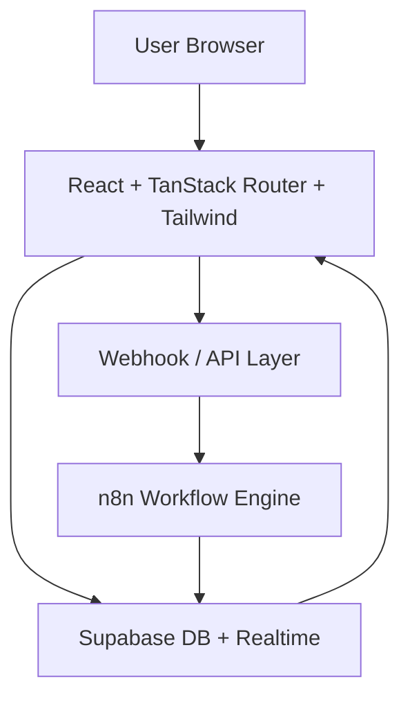
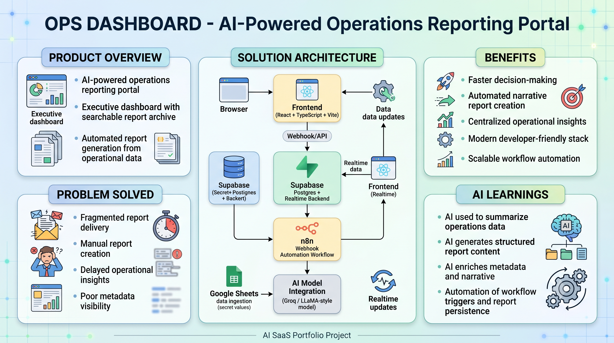
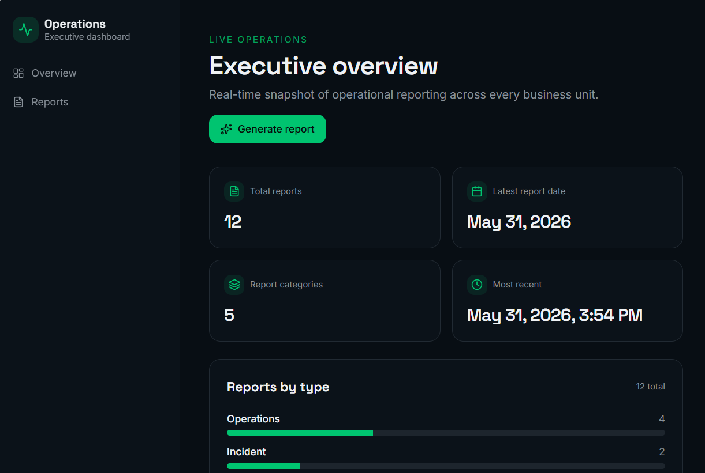
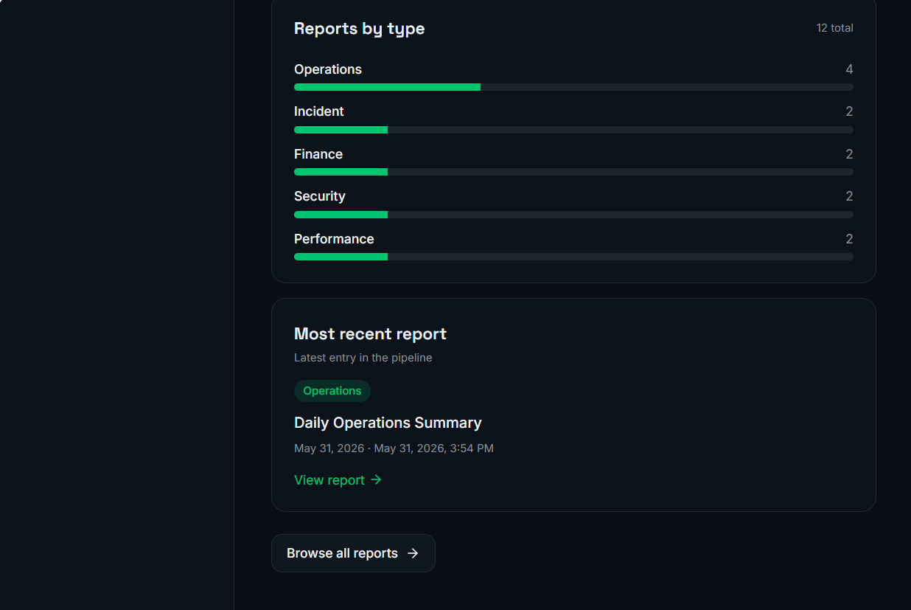
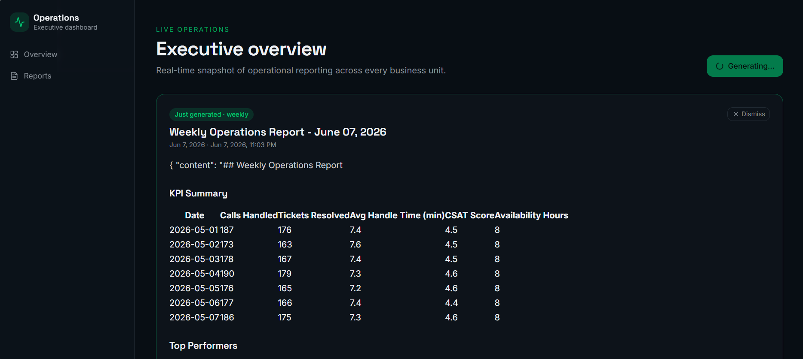

# Ops Dashboard — AI Report Generator SaaS

## 🚀 Project Title
**Ops Dashboard** — an AI-powered operations reporting portal for modern teams.

## 🧠 Product Overview
Ops Dashboard is a polished AI SaaS portfolio project that combines realtime operational reporting, Supabase-backed analytics, and workflow automation via n8n.

The app delivers a clean executive dashboard, searchable report archive, and automated report generation through a webhook workflow.

## 🎯 Problem Solved
Business teams need a single place to monitor operational data, generate narrative reports, and keep stakeholders informed without juggling scattered tools.

This project solves:
- fragmented report delivery
- manual report creation
- delayed operational insights
- poor visibility into report metadata

## 🏗 Solution Architecture
The solution blends a React/TanStack frontend, Supabase for storage and realtime updates, and n8n for backend workflow automation.



## ✨ Features
- Executive dashboard with total reports, recent metrics, and report type insights
- Automated AI report generation via n8n webhook
- Supabase-powered archive with search, filter, and pagination
- Report detail pages with markdown preview and metadata display
- Realtime updates through Supabase realtime subscriptions
- Modern UI built with Radix + Tailwind + TanStack React

## 🔄 Workflow Explanation
1. The user lands on the dashboard and views current operational metrics.
2. A report is generated by calling the configured `N8N_WEBHOOK_URL`.
3. n8n executes the workflow to fetch data, assemble results, and store a report record in Supabase.
4. Supabase broadcasts updates via realtime channels.
5. The frontend automatically refreshes the report list and dashboard metrics.
6. Users can browse archived reports, filter by type, and open report pages.

## 🧩 Tech Stack
- Frontend: React, TypeScript, Vite, TanStack Router, TanStack Query
- UI: Tailwind CSS, Radix UI, Lucide React
- Data: Supabase (Postgres + Auth + Realtime)
- Automation: n8n workflow engine (webhook trigger)
- Validation: Zod
- Markdown rendering: React Markdown + remark-gfm

## 🚀 Installation Steps
```bash
# Clone the repo
git clone <YOUR_REPO_URL>
cd "Ops Dashboard/frontend"

# Install frontend dependencies
bun install

# Start local development
bun run dev
```

> If you do not use Bun, substitute with `npm install` and `npm run dev`.

## 🔐 Environment Variables
Create a `.env` file from `.env.example` and set your own values.

```env
GEMINI_API_KEY=YOUR_API_KEY
SUPABASE_URL=YOUR_SUPABASE_URL
SUPABASE_ANON_KEY=YOUR_SUPABASE_KEY
N8N_WEBHOOK_URL=YOUR_WEBHOOK_URL
```

### Recommended environment files
- `.env` — local secret config
- `.env.example` — safe sample values

## 📸 Screenshots
Use the existing `screenshots/` folder and the root project explainer image for visual references.







## 🎬 Demo GIFs
> Add GIF demos to a `screenshots/` or `docs/` folder and update these links.



## 🌐 Deployment Links
- **Live app:** `https://your-deployment-url.com`
- **Demo build:** `https://your-demo-url.com`

## 🚧 Future Roadmap
- Add AI summarization and natural language report creation
- Support user authentication and team workspaces
- Add full GitHub / Slack / email report integrations
- Build a dedicated admin panel for workflow configuration
- Add analytics dashboards and alerting rules

## 👤 Creator Information
**Creator:** Your Name

- Portfolio: https://your-portfolio.example.com
- LinkedIn: https://linkedin.com/in/your-profile
- GitHub: https://github.com/your-github

## 📄 License
This project is released under the **MIT License**.
